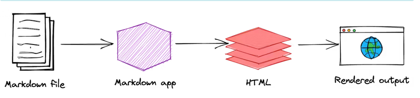
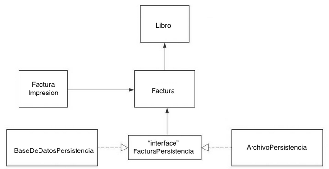
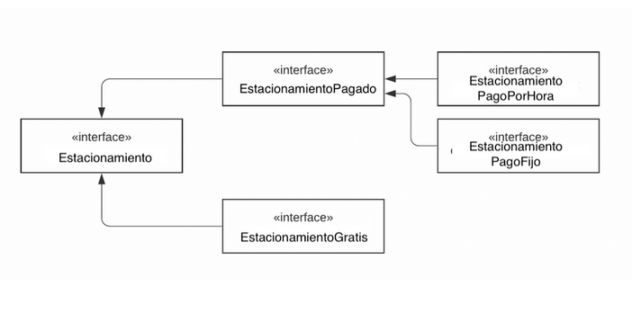

# LAB BUENAS PRÁCTICAS

## Qué es Markdown

Markdown es un lenguaje de marcado ligero, usado ampliamente en el mundo del desarrollo. Ofrece ventajas sobre las herramientas de edición WYSIWYG ('What You See Is What You Get'), que se refiere a la funcionalidad de ver el resultado final del documento en tiempo real como ejemplo mas famoso microsoft word.

Markdown funciona independientemente de la plataforma, es portátil y se encuentra en la gran mayoría de sitios web. Su uso se remite a documentar.

## ¿Cómo Funciona Markdown ?

A partir de un documento de texto con formato.md , puede llevarse a aplicaciones Markdow que procesan el documento para obtener como resultado un texto en formato html y finalmente ser visibles en navegadores web.



fuente: [markdown-guide](https://www.markdownguide.org/cheat-sheet/)

# Principios de diseño

## Solid

Son principios establecidos por Robert C. MArtin que  facilitan el desarrollo de software, creando programas legibles y mantenibles.

    S: Single responsibility principle o Principio de responsabilidad única
    O: Open/closed principle o Principio de abierto/cerrado
    L: Liskov substitution principle o Principio de sustitución de Liskov
    I: Interface segregation principle o Principio de segregación de la interfaz
    D: Dependency inversion principle o Principio de inversión de dependencia

Estos principios favoreces;  mantenimiento, escalabilidad y reutilización.

    Proposito
    Para crear código comprensible, legible y comprobable en el que muchos desarrolladores puedan trabajar en colaboración.

### S: Principio de responsabilidad única
**Una clase debe tener una única responsabilidad en el sistema**

Si tenemos la siguiente clase que representa un libro, en un escenario de representacion de una librería con un sistema de facturación.
``` java
class Libro {
	String nombre;
	String nombreAutor;
	int anyo;
	int precio;
	String isbn;

	public Libro(String nombre, String nombreAutor, int anyo, int precio, String isbn) {
		this.nombre = nombre;
		this.nombreAutor = nombreAutor;
		this.anyo = anyo;
        this.precio = precio;
		this.isbn = isbn;
	}
}
```
Al realizar la logica de facturación

```java
public class Factura {

	private Libro libro;
	private int cantidad;
	private double tasaDescuento;
	private double tasaImpuesto;
	private double total;

	public Factura(Libro libro, int cantidad, double tasaDescuento, double tasaImpuesto) {
		this.libro = libro;
		this.cantidad = cantidad;
		this.tasaDescuento = tasaDescuento;
		this.tasaImpuesto = tasaImpuesto;
	}

	public double calculaTotal() {
        //logica de calculo
	}

	public void imprimeFactura() {
    // Logíca de impresión de factura
	}

    public void guardarArchivo(String nombreArchivo) {
	// Crea un archivo con el nombre dado y escribe la factura.
	}

}
```
En este ejemplo se observa que la clase factura tiene 3 responsabilidades: calcular factura, imprimir factura y guardar factura.

Si en un escenario hipotético debemos añadir un nuevo campo "direcciónDeEnvío" únicamente para el método imprimeFactura, se deberá añadir el atributo a la clase factura. Sin embargo, hay varias clases que heredan de la clase factura y no permiten cambios. Al añadir este nuevo campo, deberán también inicializarlo, y no hacerlo produciría errores. Además, si estas otras clases hijas no deben modificarse por ningún motivo, nunca podrían aceptar este cambio, que solo debería afectar a la función de imprime factura.

### O: principio de Abierto-Cerrado

**Clases abiertas a la extensión pero cerradas a la modificación**

Debemos poder agregar nuevas funcionalidades, pero no modificar las existentes, esto debido a que pueden existir funcionalidades dependientes de las existente, su modificación afectaria todo el sistema.

Si creamos una base de datos, nos conectamos a ella y agragamos un metodo de guardado FacturaPersistencia:

```java
public class FacturaPersistencia {
    Factura factura;

    public FacturaPersistencia(Factura factura) {
        this.factura = factura;
    }

    public void guardarArchivo(String nombreArchivo) {
        // Crea un archivo con el nombre dado y escribe la factura.
    }

    public void guardarEnBaseDatos() {
        // Guarda la factura en la base de datos
    }
}
```

Si deseariamos en un futuro aumentar una nueva funcionalidad debemos modificar la clase FacturaPersistencia.
pero ... esto produciria errores nuevamente, si otras clases dependen de esta.

La mejor solución es refactorizar el codigo y poner a la clase FacturaPersistencia como una interfaz con un metodo "guardado", para que otras clases que utilicen a la interfaz FacturaPErsistencia, implemente este metodo
de acuerdo a sus necesidades especificas.

```java
interface FacturaPersistencia {

    public void guardar(Factura factura);
}
```
```java
public class BaseDeDatosPersistencia implements FacturaPersistencia {

    @Override
    public void guardar(Factura factura) {
        // Guardar en la base de datos
    }
}
```
```java
public class ArchivoPersistencia implements FacturaPersistencia {

    @Override
    public void guardar(Factura factura) {
        // Guardar en archivo
    }
}
```
Es interesante, porque nos quedaria algo asi;



Ahora nuestra logica es extensible, si tendriamos que añadir otro tipo de base de datos, simplemente tendriamos que implementar esa interfaz.

### L: Principio de sustitución de liskov

**Las subclases deben ser sustituibles por sus clases base**
Esto significa que, dado que la clase B es una subclase de la clase A, deberíamos poder pasar un objeto de la clase B a cualquier método que espere un objeto de la clase A y el método no debería dar ningún resultado extraño en ese caso.

### I: Principio de segregación de interfaz

**mantener las interfaces separadas**

Muchas interfaces que detallan tareas especificas son mejores que una interfaz de proposito general.

Si tenemos una interfaz encargada de dar el comportamiento de un estacionamiento.

```java
public interface Estacionamiento {

	void aparcarCoche(); // Reducir el recuento de puntos vacíos en 1
	void sacarCoche(); // Aumenta los espacios vacíos en 1
	void getCapacidad(); // Devuelve la capacidad del coche
	double calcularTarifa(Coche coche); // Devuelve el precio en función del número de horas.
	void hacerPago(Coche coche);
}
```

Pero, solo funciona para estacionamientos de pago, si quisieramos implementar un estacionamiento gratuito.

```java
public class EstacionamientoGratis implements Estacionamiento {

	@Override
	public void aparcarCoche() {
		
	}

	@Override
	public void sacarCoche() {

	}

	@Override
	public void getCapacidad() {

	}

	@Override
	public double calcularTarifa(Coche coche) {
		return 0;
	}

	@Override
	public void hacerPago(Coche coche) {
		throw new Exception("Estacionamiento es gratis");
	}
}
```

Tanto el metodo, "calcularTarifa" como "hacerPago" son irelevantes en le contexto de un estacionamiento gratis.

Debemos dividir la logica, una relacionada con el cmportamiento del estacionamiento y otra con la transacción.

Segregando las interfaces tenemos algo como:



Veremos como logramos separar las interfaces que describen los estacionamientos pagados y otra para estacionamientos gratis, de esta forma se pueden utilizar las interfaces dependiento si se debe implemetar, estacionamientos de pago o gratuitos.

### D: Principio de inversion de dependencia

**Nuestras clases debepender de interfaces o clases abstractas en lugar de clases y funciones concretas**

Si queremos que nuestras clases puedan extenderse, estas deben depender de interfaces en lugar de clases concretas.

En su artículo (2000), el tío Bob resume este principio de la siguiente manera:

    "Si el PAC establece el objetivo de la arquitectura OO, el PID establece el mecanismo principal".

**Si PAC establece el objetivo de la arquitectura** Principio de Arquitectura Componible

    Si se desea lograr arquitectura Orientada a Objetos

**Principio de Inversión de Dependencia**

    Debemos desacoplar las dependencias rigidas de los objetos.

Como ejemplo: Si tenemos una clase "Motor" y otra "Car"

```typescript
interface IMotor {
    on(): void;
    off(): void;
}

class Motor implements IMotor {
    on(): void {
        console.log("Motor on");
    }

    off(): void {
        console.log("Motor off");
    }
}

class Car {
    private motor: IMotor;

    constructor(motor: IMotor) {
        this.motor = motor;
    }

    start() {
        this.motor.on();
        console.log("star car");
    }

    stop() {
        this.motor.off();
        console.log("stop car");
    }
}

const motor = new Motor();
const car = new Car(motor);

car.iniciar();
car.detener();
```

Si desearimos cambiar la funcionalidad de la clase "motor", simplemente creamos una nueva clase que implemente IMotor.

### Caracteristicas de un buen sistema:
    Robustez
    : Capacidad de un sistema de mantenerse en funcionamiento en condiciones adversas

    Mantenibilidad
    : Capacidad de un sistema de ser; modificado, mejorado o reparado, el sistema debe estar bien estructurado y documentado.

    Escalabilidad
    : Capacidad del sistema de crecer y adaotarse sin afectar el rendimiento actual. 


- PascalCase: nombres de clases e interfaces en lenguajes.
- camelCase: nombres de variables y funciones.
- snake_case: nombres de archivos en lenguajes cono python y ruby.
- kebab-case: nombres de archivos, url y datos de tipo booleano.

